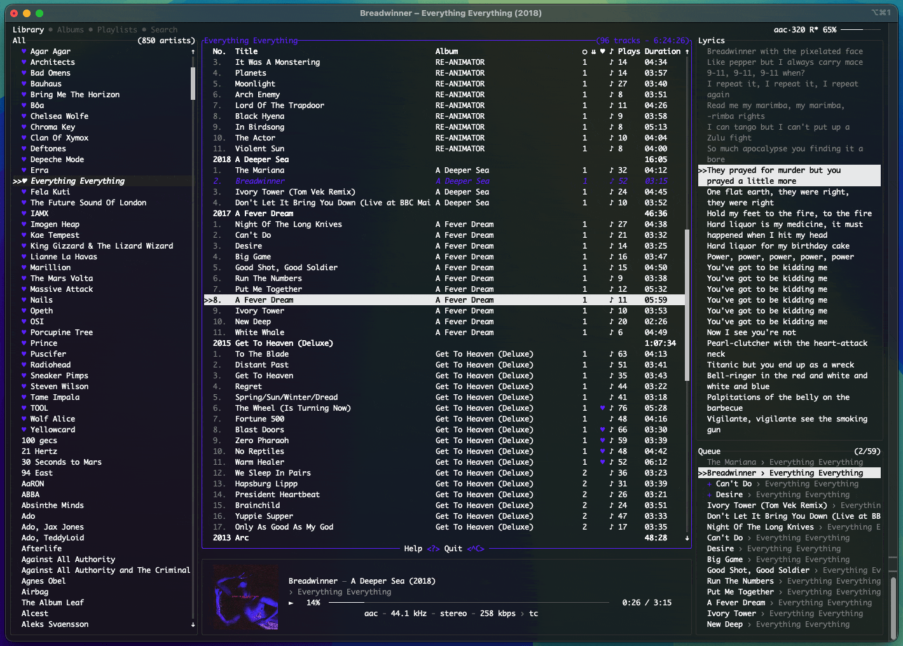
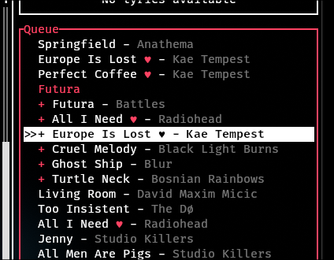
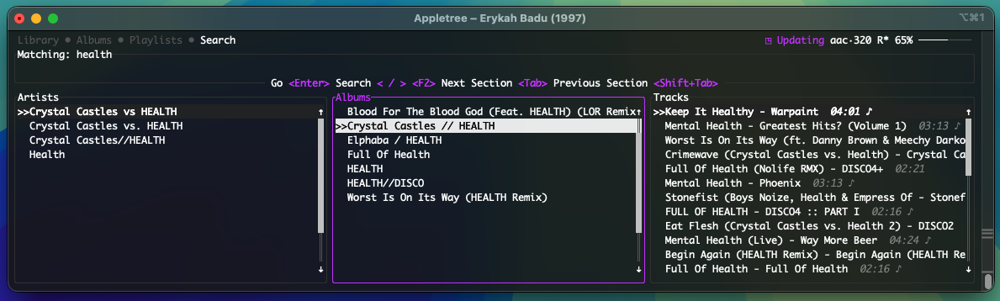
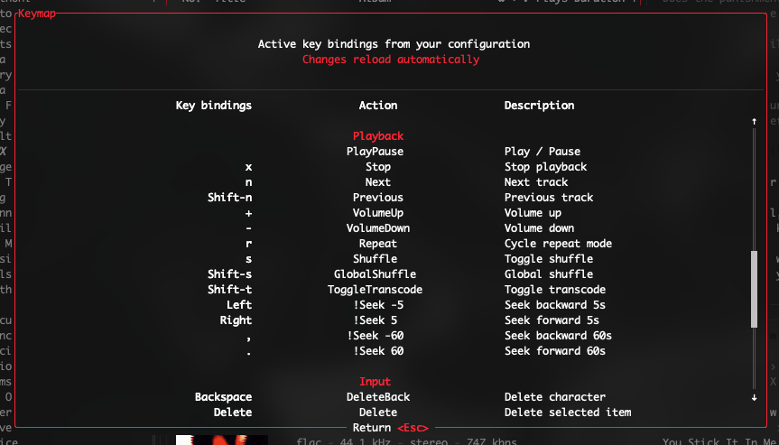
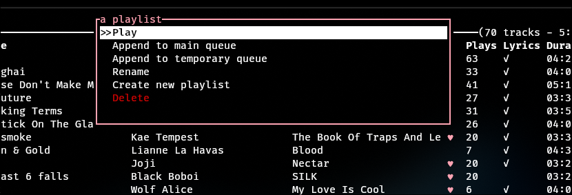
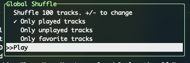

# navidrome-tui

`navidrome-tui` is a terminal music client for
[Navidrome](https://www.navidrome.org/) and other servers that expose a
compatible Subsonic API.

The current codebase is centered on Navidrome: authentication, library loading,
playback URLs, favorites, playlists and progress reporting go through
Subsonic-compatible endpoints, while audio playback is handled locally through
`mpv`.

## Current Status

This is an active Navidrome/Subsonic TUI. The application name, config paths and
package metadata use `navidrome-tui`; remaining compatibility work should keep
the user-facing surface focused on Navidrome and the Subsonic API.

The intended flow is:

1. Connect to a Navidrome server.
2. Cache library metadata locally.
3. Stream or download tracks.
4. Use the TUI as a focused terminal music player.

## Technology

- Rust 2021
- Tokio async runtime
- Reqwest HTTP client
- Navidrome/Subsonic REST API
- Ratatui + Crossterm terminal UI
- ratatui-image for terminal cover art
- libmpv2/mpv for playback
- SQLite via SQLx for cache, downloads and offline metadata
- Souvlaki for platform media controls
- Discord Rich Presence support
- YAML configuration with Serde

## Features

- Stream music from Navidrome through the Subsonic API
- Browse artists, albums, tracks and playlists
- Search artists, albums and tracks
- Queue management with Spotify-like queue behavior
- Shuffle, repeat-one, repeat-all and radio-style playback modes
- Favorites/starred tracks using Subsonic star/unstar endpoints
- Track downloads and offline playback
- Background metadata cache updates
- Album art in terminals with image protocol support
- Custom themes with album-art color extraction
- Configurable key bindings
- mpv option passthrough and mpv script loading
- MPRIS/media-key integration where supported
- Optional Discord Rich Presence

## Screenshots







## Requirements

You need a running Navidrome server and a terminal capable of running a modern
TUI application.

Build/runtime dependencies:

- Rust toolchain
- mpv
- libmpv development files
- SQLite
- OpenSSL or Rustls TLS support, depending on the selected Cargo feature

On Debian/Ubuntu:

```bash
sudo apt install mpv libmpv-dev sqlite3 libssl-dev pkg-config
```

On Arch Linux:

```bash
sudo pacman -S mpv sqlite pkgconf
```

On macOS:

```bash
brew install mpv pkg-config
```

On Windows, install `mpv` and make sure `libmpv-2.dll` is available to the
program at runtime. Do not commit DLL files to this repository.

## Installation

From this repository:

```bash
git clone https://github.com/leandro754/Navidrome-tui.git
cd Navidrome-tui
cargo install --path .
```

For local development:

```bash
cargo run
```

Available command-line options:

```text
navidrome-tui [OPTIONS]

  --version         Print version information
  --help            Print help
  --no-splash       Do not show the splash screen
  --select-server   Force server selection on startup
  --offline         Start in offline mode
```

## Configuration

On first launch, `navidrome-tui` creates the required directories and guides you
through a basic configuration.

Default paths:

- Linux: `~/.config/navidrome-tui/config.yaml`
- macOS: `~/Library/Application Support/navidrome-tui/config.yaml`
- Windows: `%APPDATA%\navidrome-tui\config.yaml`

Runtime data, logs, cover cache, databases, downloads and mpv scripts are stored
under the platform data directory in a `navidrome-tui` folder.

Example config:

```yaml
servers:
  - name: Home
    url: "https://music.example.com"
    username: "leandro"
    password: "change-me"
    default: true

  - name: Local
    url: "http://localhost:4533"
    username: "leandro"
    password_file: "/home/leandro/.config/navidrome-tui/password"

download_path: "/home/leandro/Music/navidrome-tui"

# UI
art: true
persist: true
auto_color: true
auto_color_fade_ms: 400
lyrics: "always" # always, auto, never
swap_play_pause: false
rounded_corners: true
window_title: true

# Discord Rich Presence. Use a Discord application id.
discord: 123456789012345678
discord_art: false
discord_status: "state"

# Options passed to mpv.
mpv:
  replaygain: album
  no-config: true
  log-file: /tmp/navidrome-tui-mpv.log
```

Notes:

- Server URLs should not end with a trailing slash.
- Use either `password` or `password_file`, not both.
- Navidrome authentication is performed with Subsonic token authentication.
- `--select-server` lets you choose a non-default server at startup.
- `--offline` disables network use and plays from local downloads/cache.

## mpv Scripts

`navidrome-tui` creates an `mpv-scripts` directory inside its data directory.
Scripts placed there can be loaded by mpv. You can also list scripts explicitly
in the `mpv` configuration.

The `mpv` section accepts mpv property names and values. Invalid mpv properties
may cause startup failures, so test changes incrementally.

## Downloads and Offline Mode

Press `d` on a track or album to queue a download. Press `Shift+d` to remove a
downloaded item. More download actions are available from the popup menus.

Downloaded tracks are stored under the configured `download_path` or the default
music directory. Metadata and download state are tracked in SQLite, which allows
the app to start in offline mode:

```bash
navidrome-tui --offline
```

Offline mode uses cached metadata and local files only.

## Key Bindings

Press `?` inside the application to open the built-in help page. It is the
authoritative list of supported actions and current bindings.

Key bindings can be customized in `config.yaml`:

```yaml
keymap:
  ctrl-c: Quit
  j: Down
  k: Up
  space: PlayPause
  ctrl-s: Shuffle
```

To disable one binding:

```yaml
keymap:
  ctrl-x: null
```

To start from an empty keymap:

```yaml
keymap_inherit: false
keymap:
  ctrl-q: Quit
  j: Down
  k: Up
```

Some actions accept parameters:

```yaml
keymap:
  ctrl-h: !Seek -10
  ctrl-l: !Seek 10
  q: !Shell "tmux detach"
```



## Popup Menus

Press `p` to open the context popup and `Shift+p` to open the global popup.
Popups expose actions that do not need permanent key bindings, including
download repair, queue actions, theme selection, library sync and playback
preferences.



## Queue

The queue model is similar to Spotify: you can play a list normally and still
insert temporary next-up items. Use `e` or `Shift+Enter` to add songs to the
queue, and press `?` in the application for the full queue keymap.

## Global Shuffle

Open global shuffle with `Ctrl+S`, choose the filters you want, and start
playback from a generated selection.



## Repeat and Radio

Press `R` to cycle repeat modes:

- Off: stop when playback reaches the end
- Repeat One: loop the current track
- Repeat All: loop the current queue
- Radio: keep playback going by adding more tracks

When radio is active, press `Shift+R` to cycle radio modes.

## Search

Use `/` in list views to filter locally. The Search tab performs a broader
library search across artists, albums and tracks.

## Themes

Themes are configured in `config.yaml`. A custom theme can extend a built-in
theme and override individual colors.

Color values can be:

- `"#rrggbb"`
- named colors such as `"red"`, `"white"` or `"gray"`
- `"auto"` to use the album-art accent color
- `"none"` for optional backgrounds

Example:

```yaml
themes:
  - name: "Transparent Dark"
    base: "Dark"
    background: "none"
    album_header_background: "none"
    progress_fill: "auto"
    tab_active_foreground: "auto"
```

Set this if you prefer theme colors instead of album-art colors:

```yaml
auto_color: false
```

## Supported Terminals

Terminals with image support provide the best experience:

- kitty
- iTerm2
- ghostty
- contour
- wezterm
- foot

Terminals without sixel or comparable image support can still run the TUI, but
cover art may be missing or degraded.

## Fork Notes

This repository is maintained as a Navidrome/Subsonic TUI. User-facing
documentation, packaging and runtime messages should refer to Navidrome or the
Subsonic API.

Large binary runtime files such as `*.dll`, `*.exe`, `*.so`, `*.dylib`, `*.lib`
and `*.pdb` are ignored and should not be committed.

## License

GPL-3.0. See [LICENSE](LICENSE).
